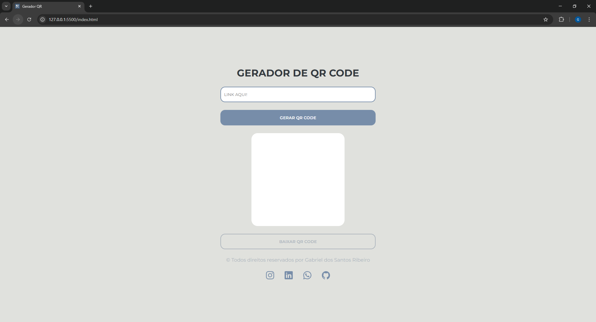
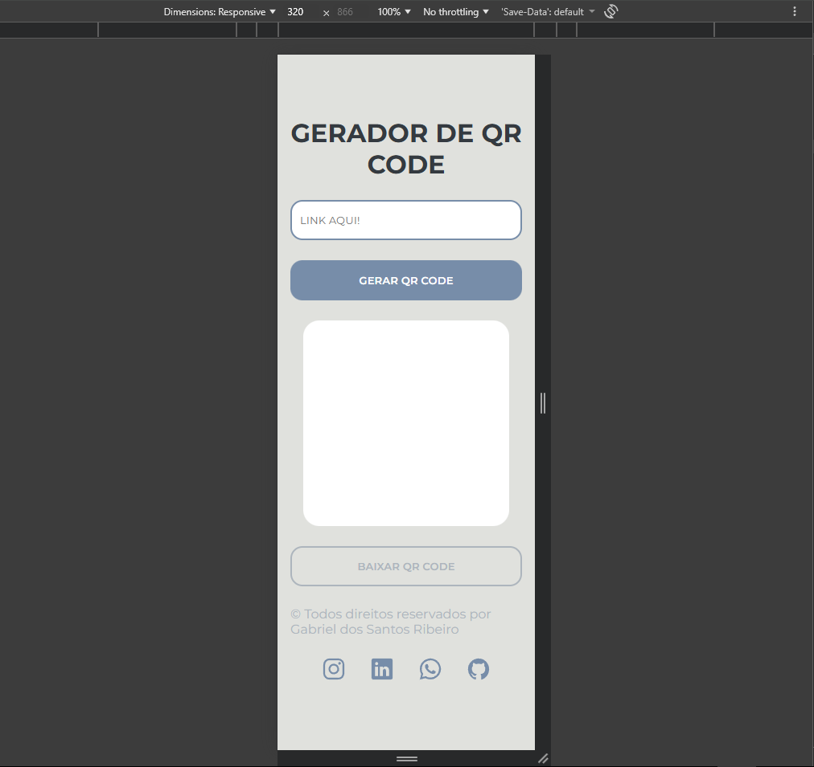
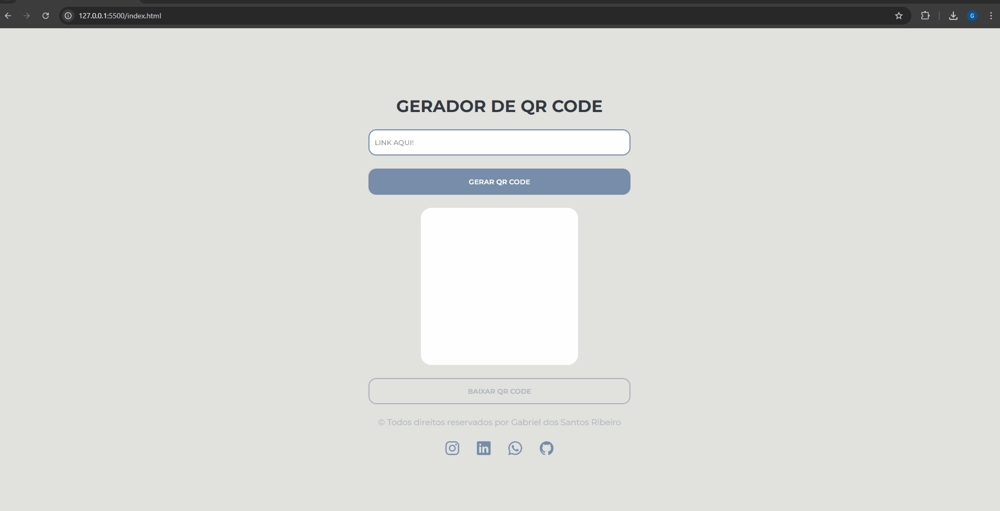

# 📱 Gerador de QR Codes

Um gerador de QR Codes simples, rápido e responsivo desenvolvido com **HTML, CSS e JavaScript**.  
O objetivo do projeto é permitir que o usuário transforme **qualquer link** em um QR Code de forma imediata, com uma interface limpa e fácil de usar.

---

## 🚀 Tecnologias utilizadas

- **HTML5**  
- **CSS3**  
- **JavaScript (ES6+)**  
- Bibliotecas utilizadas: **qrcode.js**, **jspdf.js** e **anime.js**

---

## 🎯 Funcionalidades

- Inserir qualquer link ou texto  
- Gerar QR Code instantaneamente  
- QR Code responsivo (se adapta ao tamanho da tela)  
- Botão para baixar o QR Code  
- Validação simples do input  
- Feedback visual (animação de erro)

---

## 📸 Demonstração

### 🖥️ Versão Desktop


---

### 📱 Versão Mobile


---

### 🎞️ Funcionamento (GIF)



## 🧠 O que aprendi com este projeto

- Manipulação da DOM com JavaScript  
- Uso de bibliotecas externas no front-end
- Responsividade com CSS  
- UX simples e minimalista  
- Animações CSS para erros  
- Boas práticas de UI (inputs, botões, espaçamentos)

## 📝 Como usar

1. Digite qualquer link no campo de texto.  
2. Clique no botão **GERAR QR CODE**.  
3. O QR Code aparecerá na tela.  
4. (Opcional) Clique em **BAIXAR QR CODE** para salvar a imagem.

## 📦 Instalação

Clone o repositório:

```bash
git clone https://github.com/SEU_USUARIO/gerador-qrcode.git
```

Abra o arquivo:

```bash
index.html
```

Pronto! O projeto ja funciona localmente.

---

## 📧 Contato

Se quiser falar comigo ou ver outros projetos:
- **Instagram**: [gabsref](https://www.instagram.com/gabsref)
- **LinkedIn**: [gabriel dos santos ribeiro](https://www.linkedin.com/in/gabriel-santos-ribeiro-196110257)
- **GitHub**: [gabrieldosantosribeiro](https://github.com/gabrieldosantosribeiro)